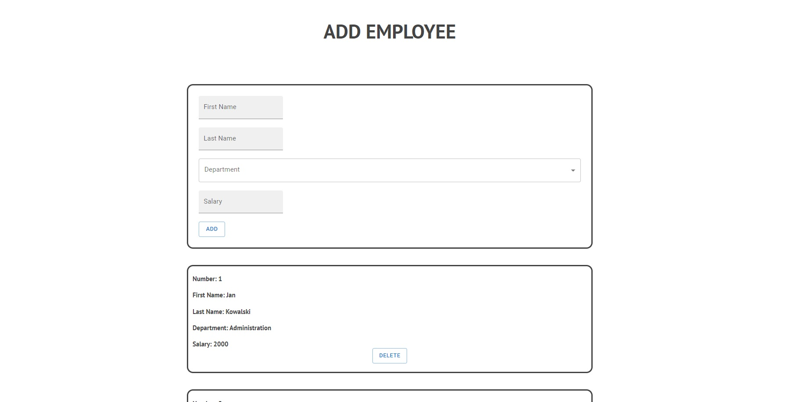
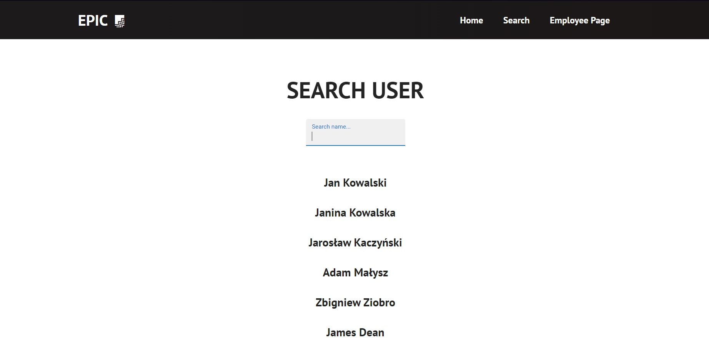

# React Employee App

## Table of contents
* [General info](#general-info)
* [Technologies](#technologies)
* [Setup](#setup)

## General info
It is a simple application designed to add new employees and search for new employees.
It is an exercise application designed to consolidate the ability to use React components, 
use the local Json server and edit its data.

I'll use jsonbin.io service instead of local json-server to deploy site and use it online




## Technologies
Project is created with:

* React.js
* JavaScript with JSX extension and AXIOS module
* HTML
* CSS
* JSON

## Setup

Firstly start json local server typing:

```
$ json-server --watch db.json
```
To run this project, install it locally using npm:

```
$ npm install
$ npm start
```

## Sources
This app is based on:
* tutorial by Brian Design
 "https://github.com/briancodex/react-navbar-dropdown"
* tutorial by Jarrett Retz
 "https://rapidapi.com/blog/axios-react-api-tutorial/"


